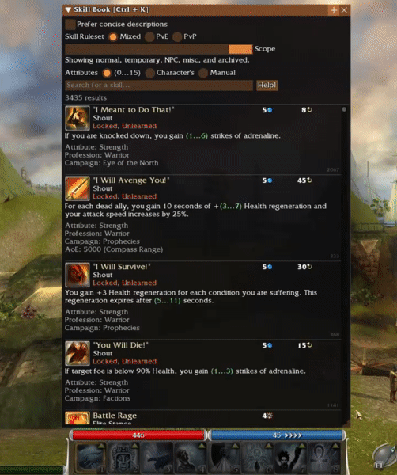

## What is it?
*Hero’s Insight* is a mod for the game *Guild Wars* focused on making gameplay and buildcrafting more enjoyable through helpful ingame tools and statistics.

The mod is named after the *Guild Wars* item: [Hero's Insight](https://wiki.guildwars.com/wiki/Hero%27s_Insight), which grants the player's character double experience while active. In the same spirit, the mod aims to do the same, but for the actual player this time 😁.

## How to install
Download the zip file from the [lastest release](https://github.com/cfognom/HerosInsight/releases/latest). Extract it to wherever you want to install the mod. It comes with a pre-intalled directory inside. You can now launch the mod by running the exe inside.

Before using the mod please check out the [FAQ](#FAQ) section.

## What does it do?
The following features available today:

### Skillbook
The skill book is a powerful tool for buildcrafters, or when you just want to find that one skill to equip. It allows filtering and sorting of all skills in the game.

For example it could be used to:
* Find all skills related to knock-down
* Find all skills giving health regen, sort by amount
* Find all skills giving +damage, sort by amount (not quite yet possible)
* Find all skills yet to be unlocked, sort by campaign

Or even, if you've completely lost your mind:
* Find all hexes, in prophecies or nightfall, yet to be learned, having a recharge of 10 seconds or less. Sort by energy cost, then by AoE range.

## Whats next?
The following features are in development:

### Active effects UI
Ability to see effects on allies and foes.

### Party stat tracking
Track stats for you and your party.
* Damage/Healing (including regen/degen)
* Conditions removed/applied
* Damaged prevented (maybe)
* Hits blocked
* Energy given
* Time spent casting
* And more...?

## FAQ
- ### Could using *Hero’s Insight* result in a ban?
  Account action, such as a ban, resulting from the **use** of *Hero’s Insight* is thought to be unlikely by the mod developer. However, this possibility cannot be ruled out, and no guarantees can be made. By using this mod, **you** acknowledge and accept all associated risks.

  *Hero’s Insight* is designed to comply, as closely as possible, with *ArenaNet's* [Code of Conduct](https://www.arena.net/en/legal/code-of-conduct) and [User Agreement](https://www.arena.net/en/legal/user-agreement). In particular:
  - The mod disables itself in PvP areas and lobbies.
  - It does not automate gameplay or provide botting functionality.

  That said, *ArenaNet* retains full discretion over enforcement of its policies, and may suspend or ban accounts at any time, for any reason. You are encouraged to review the [Code of Conduct](https://www.arena.net/en/legal/code-of-conduct) and [User Agreement](https://www.arena.net/en/legal/user-agreement) yourself and decide whether you are comfortable using the mod.

- ### Help! My antivirus software is flagging *Hero’s Insight* as Malware. Have I been infected?
  If you have downloaded the mod from this Github repository: No you have not been infected. You can safely add **Launch_HerosInsight.exe** and **data/HerosInsight.dll** to you antivirus software's whitelist/exlusion list and keep using the mod.

  *Antivirus software uses a range of heuristics to determine if something is malware or not. Sometimes these heuristics fail and you get false positives. In the case of *Hero’s Insight*, the antivirus software might have flagged the mod because it is relatively unknown, has a small user base or employs techniques such as DLL injection. DLL injection is a method also used by malware sometimes, however in this case for a completely benign purpose.*

- ### Is *Hero’s Insight* compatible with [GWToolbox](https://www.gwtoolbox.com/)?
  For the most part it should be. There might be some problems with input when a *GWToolbox* and a *Hero’s Insight* window is overlapping. Please report any issues you find by opening an issue on Github.

  For a smooth experience it is recommended to shut them down in the reverse order as they were started in. Just like a stack of pancakes: the last one put on is the first one that should be removed (unless you want to make a big mess).

## Contributions
You are very welcome to report bugs by opening issues and provide feedback and/or feature requests using discussions here in Github.

However, contributing to *Hero’s Insight* is currently hard because it is dependent on a closed source fork of *GWCA*. You cannot build the project without it.
